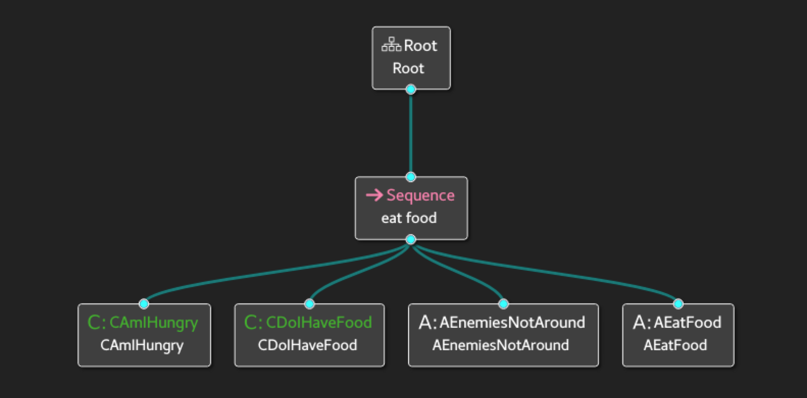

# BehaviorTree.py

Python version of behavior tree.

Follow the style of [BehaviorTree.CPP](https://github.com/BehaviorTree/BehaviorTree.CPP) and support Groot interface.

> ## What is a Behavior Tree?
>
> A Behavior Tree (**BT**) is a way to structure the switching between different tasks in an autonomous agent, such as a robot or a virtual entity in a computer game.
>
> BTs are a very efficient way of creating complex systems that are both modular and reactive. These properties are crucial in many applications, which has led to the spread of BT from computer game programming to many branches of AI and Robotics.
>
> If you are already familiar with Finite State Machines (**FSM**), you will easily grasp most of the concepts but, hopefully, you will find that BTs are more expressive and easier to reason about.
>
> The main advantages of Behavior Trees, when compared to FSMs are:
>
> - **They are intrinsically Hierarchical**: this means that we can *compose* complex behaviors including entire trees as sub-branches of a bigger tree. For instance, the behavior "Fetch Beer" may reuse the tree "Grasp Object".
> - **Their graphical representation has a semantic meaning**: it is easier to "read" a BT and understand the corresponding workflow. State transitions in FSMs, by comparisons, are harder to understand both in their textual and graphical representation.
> - **They are more expressive**: Ready to use ControlNodes and DecoratorNodes make possible to express more complex control flows. The user can extend the "vocabulary" with his/her own custom nodes.

## Installation

```
pip install behaviortree
```

## Get Started

This is a [Sequence case](/sample/EatFood). The structure of the behavior tree is as follows in Groot.



The xml file corresponds to the diagram and supports Groot.

```xml
<?xml version="1.0"?>
<root main_tree_to_execute="BehaviorTree">
    <BehaviorTree ID="BehaviorTree">
        <Sequence name="eat food">
            <Condition ID="CAmIHungry"/>
            <Condition ID="CDoIHaveFood"/>
            <Action ID="AEnemiesNotAround"/>
            <Action ID="AEatFood"/>
        </Sequence>
    </BehaviorTree>
</root>
```

Read the xml file and register the functions in the program as a tree.

```python
import sys
from behaviortree.tree import Tree

def CAmIHungry():
    print(sys._getframe().f_code.co_name)
    return True

def CDoIHaveFood():
    print(sys._getframe().f_code.co_name)
    return True

def AEnemiesNotAround():
    print(sys._getframe().f_code.co_name)
    return True

def AEatFood():
    print(sys._getframe().f_code.co_name)
    return True

xmlfile = "sample/EatFood/tree.xml"

bt_tree = Tree()
func_list = bt_tree.get_func_name(xmlfile)
eval_func = list(map(eval, func_list))
# Generate behavior tree。
bt_tree.gen_tree(xmlfile, eval_func)
# Print the structure of the tree。
bt_tree.dump()
# Execution tree。
bt_tree.run()
```

operation result.

```
root 1 0
 |- Sequence 2 0
     |- Condition:CAmIHungry 3 0
     |- Condition:CDoIHaveFood 3 1
     |- Action:AEnemiesNotAround 3 2
     |- Action:AEatFood 3 3
CAmIHungry
CDoIHaveFood
AEnemiesNotAround
AEatFood
```

